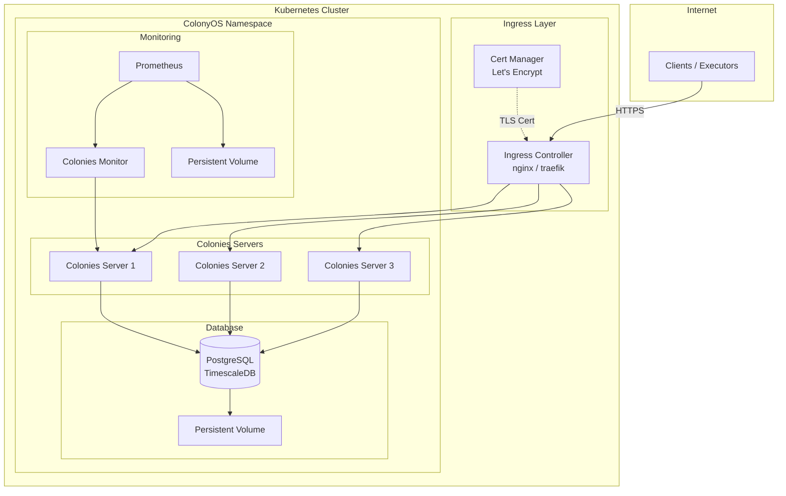

# ColonyOS Helm Chart

This Helm chart deploys a complete ColonyOS environment on Kubernetes, including the Colonies server, PostgreSQL database, monitoring stack, and supporting services.

## Architecture



| Service            | Purpose                                                                     |
|--------------------|-----------------------------------------------------------------------------|
| PostgreSQL         | Stores all ColonyOS state (processes, executors, colonies, etc.)            |
| Colonies Server(s) | Provides the Colonies API. Multiple replicas for high availability.        |
| Colonies Monitor   | Exposes Prometheus metrics by scraping the Colonies API.                    |
| Prometheus         | Collects metrics from the monitor server for visualization.                 |
| Ingress Controller | Routes external traffic to Colonies servers with TLS termination.           |

## Quick Start

### Prerequisites

- Kubernetes cluster (v1.20+)
- Helm 3.x installed
- `kubectl` configured to access your cluster
- [Cert-Manager](https://cert-manager.io/) installed for automatic TLS certificates
- An ingress controller (nginx or traefik) installed
- A domain name pointing to your cluster's ingress IP
- The `colonies` CLI installed locally

### Step 1: Generate Cryptographic Keys

ColonyOS uses ECDSA cryptographic keys for authentication. Generate the required keys:

```bash
# Generate server credentials
colonies security generate

# Output example:
# Id:      233db8208164b82ef048768c0740a60901726f43b0b95903bc23d074a0ae62e1
# PrvKey:  2b8d832c4adbe5f52d09d317860507ac77d59b7bcee972ec3fa369c5dcfd9ec

# Generate colony credentials
colonies security generate

# Generate executor credentials (for CLI access)
colonies security generate
```

Save each generated ID and private key - you will need them in the next steps.

### Step 2: Configure values.yaml

Edit `values.yaml` and set the **mandatory** settings:

```yaml
# MANDATORY: Your server hostname (must have DNS pointing to your cluster)
network:
  hostname: "server.colonyos.io"

# MANDATORY: Server credentials (from Step 1)
colonies:
  serverid: "233db8208164b82ef048768c0740a60901726f43b0b95903bc23d074a0ae62e1"
  serverPrivateKey: "2b8d832c4adbe5f52d09d317860507ac77d59b7bcee972ec3fa369c5dcfd9ec"
  # RECOMMENDED: Enable faster process assignment (row-lock mechanism)
  exclusiveAssign: false

# MANDATORY: Set a secure database password
database:
  password: "your-secure-password-here"
```

**Important TLS Requirement**: ColonyOS requires valid TLS certificates. The Helm chart uses Cert-Manager to automatically obtain Let's Encrypt certificates. Make sure:
1. Cert-Manager is installed in your cluster
2. Your domain (`network.hostname`) has DNS properly configured
3. The ingress controller is accessible from the internet for ACME challenges

### Step 3: Create Namespace and Install

```bash
# Create the namespace
./create_namespace.sh

# Install the Helm chart
./install.sh
```

Wait for all pods to be running:
```bash
kubectl get pods -n colonyos -w
```

### Step 4: Configure the Environment File

Edit the `env` file with your credentials:

```bash
# Server connection settings
export COLONIES_SERVER_HOST="server.colonyos.io"  # Same as network.hostname
export COLONIES_SERVER_PORT="443"
export COLONIES_TLS="true"

# Server credentials (same as values.yaml)
export COLONIES_SERVER_ID="233db8208164b82ef048768c0740a60901726f43b0b95903bc23d074a0ae62e1"
export COLONIES_SERVER_PRVKEY="2b8d832c4adbe5f52d09d317860507ac77d59b7bcee972ec3fa369c5dcfd9ec"

# Database password (same as values.yaml)
export COLONIES_DB_PASSWORD="your-secure-password-here"

# Colony credentials (from Step 1 - second key pair)
export COLONIES_COLONY_ID="abc123..."
export COLONIES_COLONY_PRVKEY="def456..."

# Executor credentials (from Step 1 - third key pair)
export COLONIES_EXECUTOR_ID="789xyz..."
export COLONIES_EXECUTOR_PRVKEY="uvw012..."

# Performance setting - use row-lock for faster assignment
export COLONIES_EXCLUSIVE_ASSIGN="false"
```

### Step 5: Initialize ColonyOS

Source the environment and run the setup script:

```bash
# Load environment variables
source env

# Create the colony and executor
./setup_colonies.sh
```

This script will:
1. Add the server, colony, and executor keys to your local keychain
2. Create the colony
3. Register and approve the CLI executor

### Step 6: Verify Installation

```bash
# Check colony was created
colonies colony ls

# Check executor is registered
colonies executor ls

# Submit a test process
colonies function exec --func test --targettype cli
```

## Configuration Reference

### Mandatory Settings

These settings **must** be configured before installation:

| Setting                    | Description                                                      |
|----------------------------|------------------------------------------------------------------|
| `network.hostname`         | Public hostname for the Colonies server. Must have valid DNS.   |
| `colonies.serverid`        | ECDSA public key ID. Generate with `colonies security generate` |
| `colonies.serverPrivateKey`| ECDSA private key. Generate with `colonies security generate`   |
| `database.password`        | PostgreSQL password. Use a strong, unique password.             |

### Performance Settings

| Setting                    | Description                                                      | Recommended |
|----------------------------|------------------------------------------------------------------|-------------|
| `colonies.exclusiveAssign` | Process assignment mechanism. `false` uses row-lock (faster).   | `false`     |

Setting `colonies.exclusiveAssign: false` enables the row-lock based assignment mechanism, which provides significantly better performance for high-throughput workloads compared to the exclusive lock mechanism.

### High-Availability

ColonyOS servers can be deployed with multiple replicas for fault tolerance. The servers coordinate using an internal consensus mechanism.

| Replicas | Majority | Failure Tolerance |
|:--------:|:--------:|:-----------------:|
|    1     |    1     |         0         |
|    3     |    2     |         1         |
|    5     |    3     |         2         |
|    7     |    4     |         3         |

**Recommendation**: Use 3 replicas for production deployments.

### Monitoring

The chart includes Prometheus and a Colonies monitoring server. Configure Grafana with this data source:

```
http://prometheus-service.colonyos:9090
```

---

## Complete Settings Reference

### General Settings

| Setting              | Description                                                        | Default              |
|----------------------|--------------------------------------------------------------------|----------------------|
| `storageClassName`   | Kubernetes storage class for persistent volumes                    | `""`                 |
| `timezone`           | Timezone for the deployment                                        | `Europe/Stockholm`   |
| `imagePullSecrets`   | List of secret names for pulling images from private registries    | `[]`                 |

### Network Settings

| Setting                    | Description                                                   | Default   |
|----------------------------|---------------------------------------------------------------|-----------|
| `network.ingress`          | Enable Kubernetes ingress controller                          | `true`    |
| `network.exposeNodeport`   | Expose service via NodePort (alternative to Ingress)          | `false`   |
| `network.nodeport`         | NodePort number if enabled (range: 30000-32767)               | `30000`   |
| `network.ingressController`| Ingress controller type (`nginx` or `traefik`)                | `traefik` |
| `network.hostname`         | Public hostname for TLS certificate and routing               | Required  |

### Colonies Server Settings

| Setting                            | Description                                              | Default                    |
|------------------------------------|----------------------------------------------------------|----------------------------|
| `colonies.replicas`                | Number of Colonies server replicas                       | `3`                        |
| `colonies.image`                   | Docker image for Colonies server                         | `colonyos/colonies:v1.9.1` |
| `colonies.imagePullPolicy`         | Image pull policy (Always, IfNotPresent, Never)          | `Always`                   |
| `colonies.serverid`                | ECDSA public key ID for server authentication            | Required                   |
| `colonies.serverPrivateKey`        | ECDSA private key for server authentication              | Required                   |
| `colonies.resources.enabled`       | Enable CPU/memory resource limits                        | `false`                    |
| `colonies.resources.requests.cpu`  | CPU request when limits enabled                          | `1000m`                    |
| `colonies.resources.requests.memory`| Memory request when limits enabled                      | `2Gi`                      |
| `colonies.resources.limits.cpu`    | CPU limit when limits enabled                            | `2000m`                    |
| `colonies.resources.limits.memory` | Memory limit when limits enabled                         | `4Gi`                      |
| `colonies.podDisruptionBudget.enabled` | Enable PodDisruptionBudget for HA                    | `false`                    |
| `colonies.podDisruptionBudget.minAvailable` | Minimum available pods during disruption          | `1`                        |
| `colonies.updateStrategy.type`     | StatefulSet update strategy                              | `RollingUpdate`            |
| `colonies.internalhostname`        | Internal service name for Colonies server                | `colonies-service`         |
| `colonies.profiler`                | Enable Go pprof profiler                                 | `false`                    |
| `colonies.profilerPort`            | Profiler port                                            | `6060`                     |
| `colonies.cronCheckerPeriod`       | Cron job checker interval (milliseconds)                 | `1000`                     |
| `colonies.generatorCheckerPeriod`  | Generator checker interval (milliseconds)                | `500`                      |
| `colonies.verbose`                 | Enable verbose debug logging                             | `false`                    |
| `colonies.exclusiveAssign`         | Use exclusive lock for assignment (slower but stricter)  | `false`                    |
| `colonies.allowExecutorReregister` | Allow re-registering executor with same name             | `false`                    |
| `colonies.retention`               | Enable automatic process cleanup                         | `false`                    |
| `colonies.retentionPolicy`         | Retention period in seconds (default: 1 week)            | `604800`                   |

### Database Settings

| Setting                                    | Description                                          | Default                          |
|--------------------------------------------|------------------------------------------------------|----------------------------------|
| `database.host`                            | PostgreSQL hostname (internal)                       | `colonies-database-service`      |
| `database.port`                            | PostgreSQL port                                      | `5432`                           |
| `database.user`                            | PostgreSQL username                                  | `postgres`                       |
| `database.password`                        | PostgreSQL password                                  | Required                         |
| `database.image`                           | PostgreSQL Docker image                              | `timescale/timescaledb:2.23.1-pg17` |
| `database.imagePullPolicy`                 | Image pull policy (Always, IfNotPresent, Never)      | `IfNotPresent`                   |
| `database.resources.enabled`               | Enable CPU/memory resource limits                    | `false`                          |
| `database.resources.requests.cpu`          | CPU request when limits enabled                      | `500m`                           |
| `database.resources.requests.memory`       | Memory request when limits enabled                   | `1Gi`                            |
| `database.resources.limits.cpu`            | CPU limit when limits enabled                        | `1000m`                          |
| `database.resources.limits.memory`         | Memory limit when limits enabled                     | `2Gi`                            |
| `database.podDisruptionBudget.enabled`     | Enable PodDisruptionBudget for HA                    | `false`                          |
| `database.podDisruptionBudget.minAvailable`| Minimum available pods during disruption             | `1`                              |
| `database.updateStrategy.type`             | StatefulSet update strategy                          | `RollingUpdate`                  |
| `database.storage`                         | Persistent volume size for PostgreSQL                | `10Gi`                           |
| `database.timescaledb`                     | Enable TimescaleDB extension                         | `true`                           |

### Database Connection Pool Settings

| Setting                                    | Description                                          | Default |
|--------------------------------------------|------------------------------------------------------|---------|
| `database.connectionPool.maxOpenConns`     | Maximum open database connections per replica        | `100`   |
| `database.connectionPool.maxIdleConns`     | Maximum idle connections (should equal maxOpenConns) | `100`   |
| `database.connectionPool.connMaxLifetime`  | Connection maximum lifetime in seconds               | `300`   |
| `database.connectionPool.connMaxIdleTime`  | Connection maximum idle time in seconds              | `60`    |

### Monitoring Settings

| Setting                                    | Description                                      | Default                  |
|--------------------------------------------|--------------------------------------------------|--------------------------|
| `monitoring.enabled`                       | Deploy monitoring server                         | `true`                   |
| `monitoring.interval`                      | API polling interval in seconds                  | `10`                     |
| `monitoring.server`                        | Service name for Colonies monitor                | `colonies-monitor-service` |
| `monitoring.resources.enabled`             | Enable CPU/memory resource limits                | `false`                  |
| `monitoring.resources.requests.cpu`        | CPU request when limits enabled                  | `500m`                   |
| `monitoring.resources.requests.memory`     | Memory request when limits enabled               | `4Gi`                    |
| `monitoring.resources.limits.cpu`          | CPU limit when limits enabled                    | `1000m`                  |
| `monitoring.resources.limits.memory`       | Memory limit when limits enabled                 | `8Gi`                    |
| `monitoring.podDisruptionBudget.enabled`   | Enable PodDisruptionBudget for HA                | `false`                  |
| `monitoring.podDisruptionBudget.minAvailable` | Minimum available pods during disruption      | `1`                      |

### Prometheus Settings

| Setting                                    | Description                                          | Default           |
|--------------------------------------------|------------------------------------------------------|-------------------|
| `prometheus.enabled`                       | Deploy Prometheus                                    | `true`            |
| `prometheus.image`                         | Prometheus Docker image                              | `prom/prometheus` |
| `prometheus.imagePullPolicy`               | Image pull policy (Always, IfNotPresent, Never)      | `Always`          |
| `prometheus.storage`                       | Persistent volume size for Prometheus                | `10Gi`            |
| `prometheus.resources.enabled`             | Enable CPU/memory resource limits                    | `false`           |
| `prometheus.resources.requests.cpu`        | CPU request when limits enabled                      | `500m`            |
| `prometheus.resources.requests.memory`     | Memory request when limits enabled                   | `4Gi`             |
| `prometheus.resources.limits.cpu`          | CPU limit when limits enabled                        | `1000m`           |
| `prometheus.resources.limits.memory`       | Memory limit when limits enabled                     | `8Gi`             |
| `prometheus.podDisruptionBudget.enabled`   | Enable PodDisruptionBudget for HA                    | `false`           |
| `prometheus.podDisruptionBudget.minAvailable` | Minimum available pods during disruption          | `1`               |
| `prometheus.scrapeInterval`                | Prometheus scrape interval                           | `10s`             |

## Troubleshooting

### TLS Certificate Issues

If you see certificate errors:
1. Verify Cert-Manager is installed: `kubectl get pods -n cert-manager`
2. Check certificate status: `kubectl get certificates -n colonyos`
3. Check certificate requests: `kubectl get certificaterequests -n colonyos`
4. Verify DNS is pointing to your ingress IP

### Connection Issues

```bash
# Check pod status
kubectl get pods -n colonyos

# Check Colonies server logs
kubectl logs -n colonyos colonies-statefulset-0

# Check ingress configuration
kubectl get ingress -n colonyos
kubectl describe ingress -n colonyos colonies-ingress
```

### Database Issues

```bash
# Check PostgreSQL pod
kubectl get pods -n colonyos | grep database

# Check PostgreSQL logs
kubectl logs -n colonyos colonies-database-statefulset-0

# Connect to database directly
kubectl exec -it -n colonyos colonies-database-statefulset-0 -- psql -U postgres
```
