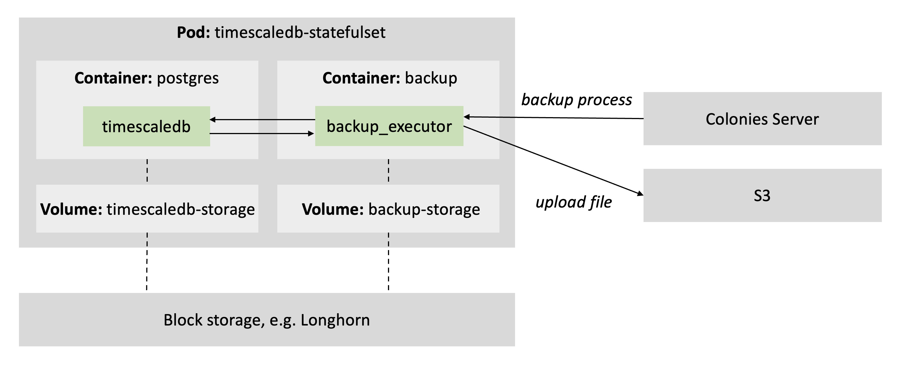

# Introduction
This helm chart installs a TimescaleDB server with a Colonies Backup Executor sidecar. 
The Backup Executor automatically uploads backups to a S3 bucket.

# Backup Exectuor 
Backups are automatically performed by the Colonies Backup Executor. A cron backup workflow is schedule to run every night. 



Backups are managed by the *backup_executor* running along side the timescaledb container in the timescaledb-statefulset. It is connects to the Colonies server and is assigned backup processes. 
When assigned, it connects to the timescaledb server in the timescaledb container and runs the following command:

```console
pg_dump -h localhost -p 5432 -U postgres -Fc -f /backups/backup_XXXXXXX.bak 
```
, where XXXXXXX is a Unix timestamp. 

The *backups* directory is mounted to the *backup_storage* volume. It then uploads the backup file to a S3 bucket. 

## How to trigger a backup immediately?
```console
colonies function exec --func backup --targettype backup
```

## How to list successful backup processes?
```console
colonies process pss --type backup
```
Output:
```console
+------------------------------------------------------------------+----------+------+---------------------+---------------+
|                                ID                                | FUNCNAME | ARGS |      END TIME       | EXECUTOR TYPE |
+------------------------------------------------------------------+----------+------+---------------------+---------------+
| c88a1451fef4609e2586d42608bad561d80ec196816f8516fb5107c6912ed6b7 | backup   |      | 2023-06-05 15:20:55 | backup        |
| b91081b4d13430cbf6f2ef918b46c6b10e3907b62d55534ec5b4cf0797119e32 | backup   |      | 2023-06-06 03:57:09 | backup        |
+------------------------------------------------------------------+----------+------+---------------------+---------------+
```

## How to list failed backup processes?
```console
colonies process psf --type backup
```
Output:
```console
INFO[0000] No failed processes found                     ColonyId=4787a5071856a4acf702b2ffcea422e3237a679c681314113d86139461290cf4
```

## How to list running backup processes?
```console
colonies process ps --type backup
```
Output:
```console
INFO[0000] No running processes found                     ColonyId=4787a5071856a4acf702b2ffcea422e3237a679c681314113d86139461290cf4
```

## How to get the result of a backup process?
```console
colonies process get -p c88a1451fef4609e2586d42608bad561d80ec196816f8516fb5107c6912ed6b7 --out
```
Output:
```json
{
    "filename": "backup_1685968191.bak",
    "bucket": "backup",
    "filepath_s3": "/backups/backup_1685968191.bak",
    "exectime_backup": 45,
    "size": 1234567,
    "size_s3": 1234567,
    "exectime_upload_s3": 5 
}
```
The backup procedure took 45 seconds to complete and it took 5 seconds to upload the backup file to S3. The size of the backup file is 1234567 bytes.  

## How to determine the next time a backup will run?
```console
colonies cron ls
```
Output:
```console
+------------------------------------------------------------------+---------------+
|                              CRONID                              |     NAME      |
+------------------------------------------------------------------+---------------+
| 43d130e6bbb836edd197947dff4390f3b7431e044868f42810d5d8a5781362ac | backupcron    |
+------------------------------------------------------------------+---------------+
```

```console
colonies cron get --cronid  43d130e6bbb836edd197947dff4390f3b7431e044868f42810d5d8a5781362ac 
```
Output:
```console
Cron:
+-------------------------+------------------------------------------------------------------+
| Id                      | 43d130e6bbb836edd197947dff4390f3b7431e044868f42810d5d8a5781362ac |
| ColonyID                | 4787a5071856a4acf702b2ffcea422e3237a679c681314113d86139461290cf4 |
| Name                    | backupcron                                                       |
| Cron Expression         | 0 0 1 * * *                                                      |
| Interval                | -1                                                               |
| Random                  | false                                                            |
| NextRun                 | 2023-06-07 03:00:00                                              |
| LastRun                 | 2023-06-06 03:00:00                                              |
| PrevProcessGraphID      | 3413d0588f0ccc3242119ef3181d72f599eec50fd0f820e442201e2aa400f303 |
| WaitForPrevProcessGraph | false                                                            |
| CheckerPeriod           | 1000                                                             |
+-------------------------+------------------------------------------------------------------+

WorkflowSpec:

FunctionSpec 0:
+-------------+--------+
| Func        | backup |
| Args        | None   |
| MaxWaitTime | 0      |
| MaxExecTime | 0      |
| MaxRetries  | 0      |
| Priority    | 0      |
+-------------+--------+

Conditions:
+--------------+--------+
| ColonyID     |        |
| ExecutorIDs  | None   |
| ExecutorType | backup |
| Dependencies |        |
+--------------+--------+
```
As can be seen, next backup will run at 2023-06-07 03:00:00.

## How to list the backup files uploaded to S3?
1. Log in to the backup container part of the timescaledb-statefulset pod.
```console
kubectl exec --stdin -it -n timescaledb -c backup timescaledb-statefulset-0 -- bash
```

2. Configure mc
```console
mc alias set minio https://s3.colonyos.io ACCESS_KEY SECRET_ACCESS_KEY
```

3. List backup files
```console
mc ls minio/backup/backups --insecure
```

## How to get logs from the backup executor?
```console
kubectl logs timescaledb-statefulset-0 -c backup -n timescaledb 
```
Output:
```console
time="2023-06-05T14:44:10+02:00" level=info msg="Backing up database ..."
time="2023-06-05T15:30:46+02:00" level=info msg="Successfully backup database" ExecTime="2796 seconds" Filename=backup_1685969050.bak Si
ze="17027681483 bytes"
time="2023-06-05T15:30:46+02:00" level=info msg="Uploading backup file to S3 ..."
time="2023-06-05T15:34:32+02:00" level=info msg="Successfully uploaded backup file" ExecTime="45 seconds" Size="1234567 bytes"
time="2023-06-05T15:34:32+02:00" level=info msg="Removed local backup file" Filepath=/backups/backup_1685969050.bak
time="2023-06-05T15:34:32+02:00" level=info msg="Removing old backup files ..."
time="2023-06-05T15:34:32+02:00" level=info msg="Backup procedure completed, closing process ..."
```

# How to create a cron workflow?
Create a file called backup_workflow.json with the content below:
```json
[
    {
        "nodename": "backup",
        "funcname": "backup",
        "conditions": {
            "executortype": "backup"
        }
    }
]
```

```console
colonies cron add --name backupcron --cron "0 0 1 * * *" --spec ./backup_workflow.json
```

A backup will now run at 01:00 UTC, or 03:00 CEST.

# How to restore a backup? 
1. Login in to the backup pod (it has mc pre-installed) 
```console
kubectl exec --stdin -it -n timescaledb -c backup timescaledb-statefulset-0 -- bash
```

2. Configure mc
```console
mc alias set minio https://s3.colonyos.io ACCESS_KEY SECRET_ACCESS_KEY
```

3. List available backup files
```console
mc ls minio/backups/backups
```

4. Copy backup file to the pod
```console
mc cp minio/backup/backups/backup_1685968191.bak .
```

5. Connect to the database 
```console
psql -h timescaledb-service -p 5432 -U postgres
```

The password can be found to the values.yaml file.

1. Restore the backup, in the psql tool type:
We assume that the database is called postgres.

```console
CREATE DATABASE postgres;
\c postgres
CREATE EXTENSION IF NOT EXISTS timescaledb;
SELECT timescaledb_pre_restore();
\! pg_restore -Fc -d postgres /backup_1685968191.bak
SELECT timescaledb_post_restore();
```

Note that this might take a long time. It is hence recommended to use tmux.

7. Log into the postgres container to check that all files are there
```console
kubectl exec --stdin -it -n timescaledb -c postgres timescaledb-statefulset-0 -- bash
ls /var/lib/postgresql/data/db
```

8. Show tables in a database 
```console
psql -h timescaledb-service -p 5432 -U postgres
postgres=# \c postgres
You are now connected to database "postgres" as user "postgres".
postgres=# \dt
                  List of relations
 Schema |           Name           | Type  |  Owner
--------+--------------------------+-------+----------
 public | mytable                  | table | postgres
(1 rows)
```

9. Determine size of table
```console
postgres=# SELECT COUNT(*) FROM mytable;

  count
---------
 20 
(1 row)
```
